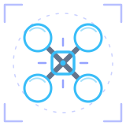

<div align="center">



# Drone Simulator

**Fly a racing quad or a scout helicopter over a procedural city.**<br>
Seven-mission story campaign, hostile drones, two-player battles — all in a browser tab.

<br>

[](https://4riful.github.io/drone-simulator/)

<br>


</div>

---

## What is this?

A flight sim that behaves like a game. You take off from a command base, fly over
a city of ~500 m of procedural blocks, follow a handler's voice through a story
campaign, and dogfight drones that shoot back. Fuel drains, the battery sags, the
radio link degrades the further out you push, and running dry drops you out of
the sky.

**Everything you see is generated in code.** No 3D models, no textures, no sprites,
no sound files. Buildings, traffic, neon, rain, explosions and every gunshot are
built at runtime — which is why the whole thing has exactly one runtime
dependency.

> **Heads up:** this project was vibe-coded — built conversationally with Claude
> rather than planned up front. It works and it is fun to fly, but the seams show:
> one 5,000-line module, an assisted flight model, and client-side hit detection.
> Everything sketchy is listed in [Known gaps](#known-gaps). Nothing is hidden.

## Quick start

```bash
git clone https://github.com/4riful/drone-simulator.git
cd drone-simulator
npm install
npm run dev          # → http://localhost:5173
```

| Command | What it does |
|---|---|
| `npm run dev` | Vite dev server, bound to `0.0.0.0` so you can fly it from your phone |
| `npm run preview` | Production-style static preview |
| `npm run check` | Parses `src/main.js` and reports syntax errors |
| `npm run vendor` | Regenerates `vendor/` — see [Deploying](#deploying) |

**Needs:** Node 18+ and a WebGL2 browser. That's it.

`index.html` is the preflight page — mode and airframe select, no WebGL.
`game.html` is the simulator. They're separate documents so the first paint never
pays for the renderer.

## Controls

| Key | Action | | Key | Action |
|---|---|---|---|---|
| `W` `S` / `↑` `↓` | Forward / back | | `F` / mouse | Fire |
| `A` `D` | Strafe left / right | | `Tab` | Boost |
| `Q` `E` / `←` `→` | Yaw | | `B` / `Ctrl` | Emergency brake |
| `Space` | Climb | | `T` | Lock target |
| `Shift` | Descend | | `L` | Follow assist |
| `R` `V` | Pitch trim | | `C` | Camera distance |
| `H` | Help | | `Esc` / `P` | Pause |

🎮 **Gamepad** — Mode 2 layout, auto-detected, with deadzone, expo, per-axis
sensitivity and inversion in settings.
📱 **Touch** — dual sticks plus fire / boost / up / down / lock / brake.

## How it flies

The controller is a **per-axis target-velocity integrator**, not rigid-body
physics. Your stick picks a target velocity in the yaw frame and the aircraft
accelerates toward it. Pitch and roll are *visual* — the airframe banks to sell
the motion, it doesn't generate it. Yaw is the only axis with true angular
velocity and damping.

It reads well in the hand. It is not a trainer. Real force/torque is planned in
`docs/FLIGHT_MODEL_PLAN.md`.

Everything is tuned from the `C` block at the top of `src/main.js`:

| Parameter | Value |
|---|---|
| Max thrust | 42 m/s² — about 4.3 : 1 thrust-to-weight |
| Top speed | 48 m/s horizontal (~173 km/h) · 20 m/s vertical |
| Max tilt | 0.78 rad (~45°) |
| Yaw | 3.5 rad/s, accel 12, damping 5 |
| Motor lag | 40 ms input smoothing |
| Ground effect | +20% lift below 5 m |

On top of that sits a whole systems layer: wind, gusts and turbulence; air
density thinning with altitude (1.0 → 0.82); fuel burn scaled by throttle and
boost; battery voltage derived from fuel and load (25.2 → 18.0 V); signal
strength that decays with range and low altitude; and a GPS fix that degrades
**3D → 2D → NO FIX** as the link gets worse. Empty the tank and you get a
five-second engine-failure countdown, then an unpowered fall.

**Two airframes**, same controller, different multipliers:

| | Airframe | Feel |
|---|---|---|
| 🛩️ | **MQ-9 Reaper** | Baseline. Fast, snappy, 45° banks. |
| 🚁 | **MQ-8B Fire Scout** | 0.82× speed, 0.65× tilt, heavier throttle response. |

## What's in the world

**🌆 The city** — 500 m grid on 84 m blocks, procedural buildings, roads, two
waterways and a bridge, four named districts (Command Base, Downtown Core,
Riverfront, Industrial Yard), a forward airstrip and a harbor yard, moving
traffic, neon signage, rain, smoke, particles, and a time-of-day atmosphere with
post-processing.

**🎯 The campaign** — *Operation Andromeda*: 7 missions across 3 acts, unlocked in
sequence, driven by an objective state machine in `src/story/campaign.js`. Two
handlers talk to you on the radio — Maj. Elena Voss and Col. Marcus Reyes — with
a brief before and a debrief after every sortie. Best scores are saved per
mission.

> First Light → Ghost Signal → Cut The Bridge → Blackout Run → Hornet's Nest →
> The Handler → Last Light

**🕹️ Free modes** — Single · Training (no hostiles, 0.35× score) · Mission
(1.25× score) · Free Flight · Online Battle.

**💥 Combat** — 7 hostile drones, 260 m/s projectiles, 110 ms fire rate, 150 HP
hull, lock-on with follow assist, rings, orbs, power-ups, explosions.

**👨‍✈️ Pilots** — local profiles tracking callsign, sorties, score, range, kills
and flight time, plus four personas that trade score against fuel and signal:

| Persona | Trade |
|---|---|
| Recon Specialist | +8 signal, 0.95× score, 0.96× fuel burn |
| Combat Pilot | 1.12× score, 1.08× fuel burn |
| Test Pilot | +2 signal, wider speed envelope, rougher air |
| Instructor | +5 signal, 0.90× score, 0.92× fuel burn |

**📟 HUD** — heading, speed, altitude, attitude, hull, boost, fuel, battery,
signal, GPS, air density, threat count, radar/minimap, kill feed and warnings.

## Online Battle

Two-player rooms over **Supabase Realtime** — Broadcast carries drone state and
hit events, Presence tracks who's in the room. GitHub Pages can't host an
authoritative server, so this is the free path.

```
Create a battle  →  copy the invite code (DRN-482K)  →  friend joins by link or code
```

Synced: callsign, persona, aircraft, position, rotation, velocity, health, fuel,
hits.

> ⚠️ **Hit validation is client-side.** Anyone can edit their own damage. Making
> it authoritative is a to-do, not a shipped feature.

Setup lives in `docs/FREE_MULTIPLAYER_SETUP.md`. Optional cloud-synced battle
profiles need the SQL in `docs/SUPABASE_BATTLE_PROFILE_SETUP.md` — without those
tables, records stay local and the UI reports sync as pending.

## Deploying

**There is no build step.** GitHub Pages serves this repo as-is, straight off
`main`.

That only works because the bare specifiers the sources import (`three`,
`three/addons/…`) — which normally need a bundler — are resolved by an import map
in `game.html`:

```json
{ "imports": { "three": "./vendor/three.module.min.js",
               "three/addons/": "./vendor/three/addons/" } }
```

`vendor/` is generated, not hand-maintained. It holds the minified three build
plus only the 13 addon files actually reachable from the simulator's imports —
816 KB, against 23 MB for all of `examples/jsm`. Regenerate it after bumping
three or adding a new addon import:

```bash
npm run vendor
```

`scripts/vendor-three.mjs` walks the import graph and copies what it reaches, so
a missing addon is a loud error at vendor time instead of a blank screen in
production. And if the graph fails to load anyway, `game.html` runs a 20-second
watchdog that swaps the loading overlay for a real error message and a reload
button, rather than spinning forever.

## Project layout

```
index.html              Landing page — mode + aircraft select, no WebGL
game.html               Simulator shell — menus, HUD, help overlay
│
├─ src/home.js          Landing page logic          (202 lines)
├─ src/home.css         Landing page styling
├─ src/styles.css       Terminal UI, cockpit HUD, menus, responsive
├─ src/main.js          Everything else            (5,025 lines)
│                       state · world gen · flight loop · HUD · audio
│                       input · storage · networking
├─ src/render/
│   ├─ atmosphere.js    Time-of-day sky and lighting  (435 lines)
│   └─ postfx.js        Post-processing chain         (179 lines)
└─ src/story/
    └─ campaign.js      Campaign data + MissionDirector (465 lines)

check-module.mjs        Syntax check behind `npm run check`
scripts/                vendor-three.mjs — builds vendor/ for the static host
vendor/                 Generated. three + the addons the game reaches
docs/                   Flight model plan · multiplayer setup · Supabase SQL
```

## Known gaps

Ordered by how much they'd bother you.

| | Gap |
|---|---|
| 🟠 | `src/main.js` is one 5,000-line module. Splitting it into state / input / world / entities / sim / UI is the next structural job. |
| 🟠 | Multiplayer hit detection is client-authoritative. |
| 🟡 | Flight is target-velocity, not rigid-body — no torque, no per-motor thrust. |
| 🟡 | Profiles are browser-local (IndexedDB, localStorage fallback). |
| 🟡 | No automated tests — `npm run check` only parses. |
| ⚪ | No LICENSE file yet. |

`ROADMAP.md` has the phased plan.

## Credits

Three.js for rendering · [JetBrains Mono](https://www.jetbrains.com/lp/mono/)
(OFL-1.1) · [Tabler Icons](https://tabler.io/icons) (MIT) · everything visual
generated procedurally. Full list in `ATTRIBUTIONS.md`.

<div align="center"><br><sub>Built in the browser, for the browser.</sub></div>
